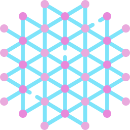

	

<h1 align="center">
	Particle Life 2D
</h1>

	
	

	Life is made up of elementary particles.

## 🛠️ Usage

See this [website](https://particle-life-2d.vercel.app).

## ✍️ Credits

<a href="https://www.flaticon.com/free-icons/nanotechnology" title="nanotechnology icons">
	Nanotechnology icons created by Eucalyp - Flaticon
</a>
